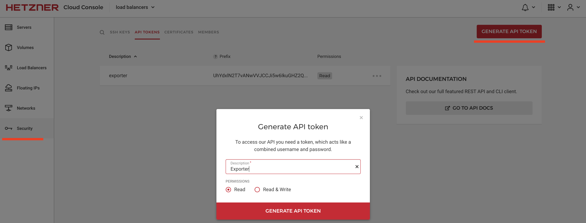
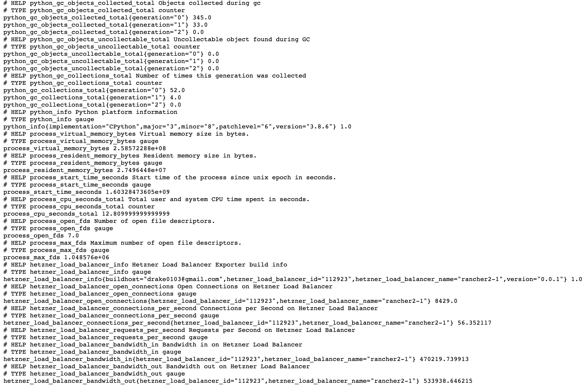
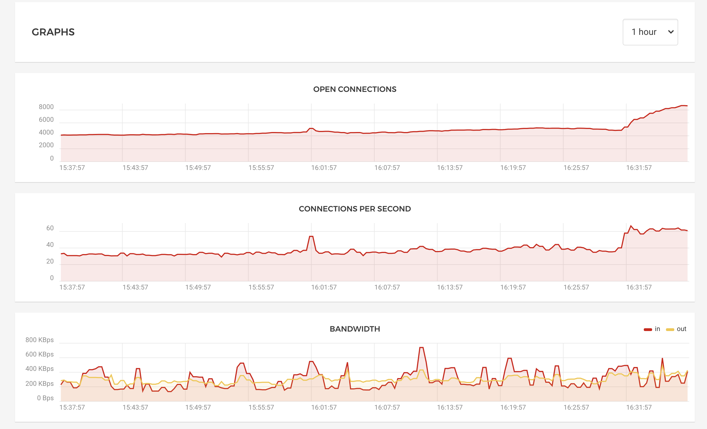
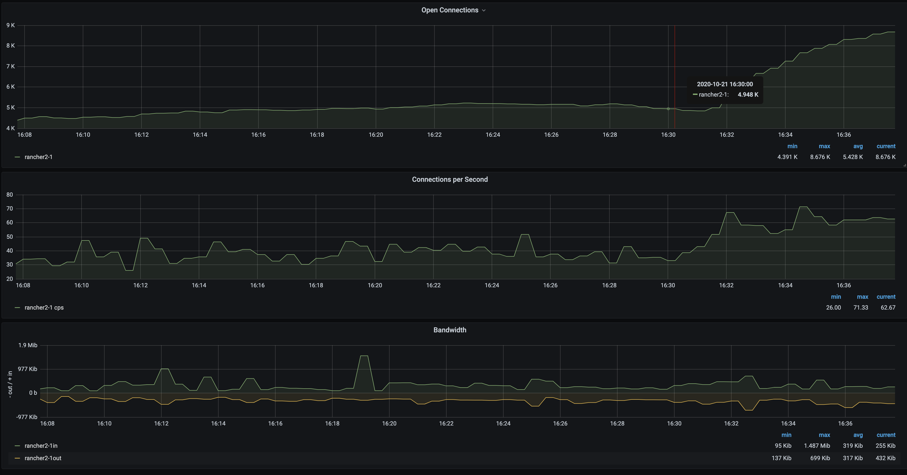

# Hetzner Load Balancer Prometheus Exporter

Exports meterics from Hetner Load Balancer for consumption by Prometheus

## Preparing

### API TOKEN

Go to [Hetzner Console](console.hetzner.cloud). Open project where you have running Load Balancer and create `API TOKEN` in Security section



### Load Balancer ID

Next we sholud get `ID` of our Load Balancer. This information we will get from `Hetner API`, everything about `API` you find in [official API documentation](https://docs.hetzner.cloud/#load-balancers-get-all-load-balancers)

Example `curl`

```bash
curl \
    -H "Authorization: Bearer $API_TOKEN" \
	'https://api.hetzner.cloud/v1/load_balancers'
```

Response sample

```json
{
  "load_balancers": [
    {
      "id": 4711,
      "name": "Web Frontend",
      "public_net": {
        "enabled": false,
        "ipv4": {
          "ip": "1.2.3.4"
        },
...
    }
}
```

### Configuring

In `deploy/kubernetes.yaml` add in `env` section id which we got from `API` and `API TOKEN`

```yaml
env:
  - name: LOAD_BALANCER_ID
  value: ""
  - name: ACCEESS_TOKEN
  value: ""
```

Deploy it to Kubernetes cluster

```bash
kubectl apply -f deploy/kubernetes.yaml
```

### Check metrics page

```bash
kubectl port-forward <pod> 8000:8000
```

Open in your browser `localhost:8000`:




## Grafana

Grafana Dashboard you can find (here)[example/grafana-dashboard/hetzner-load-balancer.json]

Metrics in Hetzner console


Metrics in Grafana
